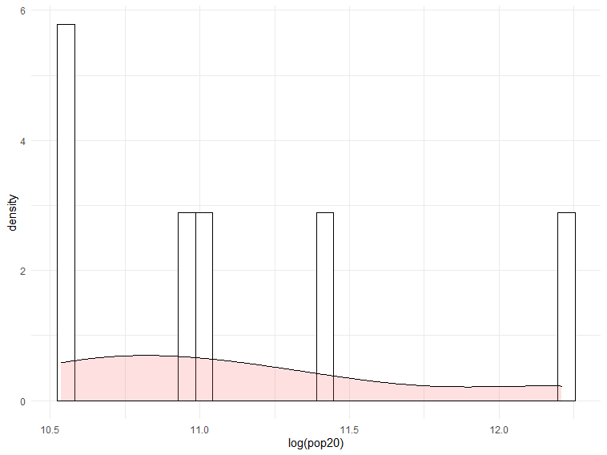

# Population Project

Here is a combined representation of Belize's population and density:

Here is a raster layer of the topography:

Here are the histograms for both pop and log(pop):

Here is the combined histogram and line graph for population and density:

Here is the combined histogram and line graph for night time lights and density:

