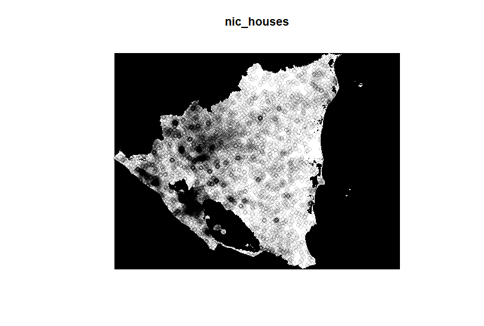
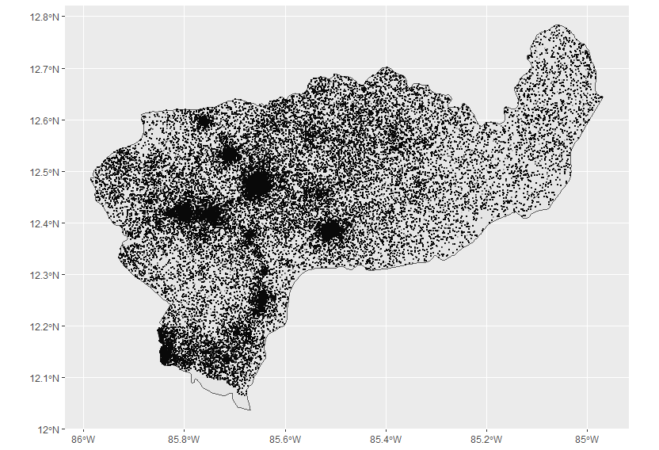
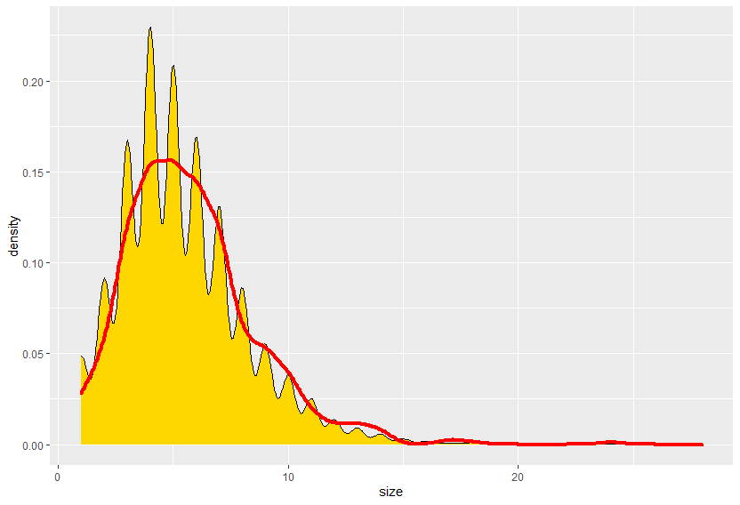
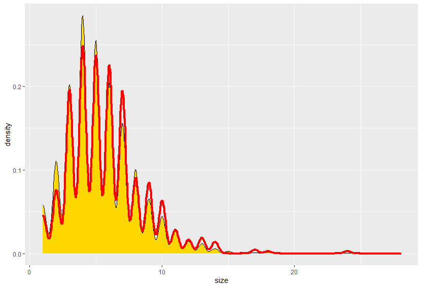

# Nicaragua Plotted Households

Here is a plot of the estimated and weighted households based on the DHS household survey conducted in 2001 in Nicaragua. They interviewed 13,060 women ages 15 to 49. The variables included information about the household members. The variables that I focused the most on are the weight, household size, location, and the age, sex, and education level of the household members. 

There were 11328 households interviewed. The average household size was 5.4 persons. There were 1271873 people in the DHS survey. My model had an estimated 1271873 people with a calculated error of 8.329556e-05. The model was created by generating random points based off of the population raster. The amount of points came from the number of households estimated by taking the sum of the population from the raster and dividing it by the average household size of the households in the DHS survey. 

When I tried to look at the persons instead of just the households, my code would not run. The issueg was the adm0 level would take up too much memory. The solution would be to either overwrite my memory or to just look at an adm1. Due to time constraints I decided to just investigate at the adm1 level.

### Boaco
I chose to pivot from households to person at the adm1 level by investigating Boaco, Nicaragua.

There is an estimated 30886 people in Boaco. My model had an estimate of 30999.53 people with a calculated error of 0.00367584. This was calculated the same way I calculated the population information for Nicaragua at the adm0 level. My model appears to be more accurate at the adm0 level. I beleive this is due to have a higher population so there is less room for error. My model is estimating a population 15.45 times higher than the actual population. This is very innacurate. I could make my model more accurate by including more variables. I could look at trasnportation, types of buildings such as hospitals or shopping areas. 

Here is the density plot:

This density plot looks at the household size and the frequency of a househod at that size. The sampled household looks at a more accurate estimate for the household size frequency. This is because it is looking at a smaller selection of houses rather than the whole population.
Here is the density plot for the sampled households:

I then created a trained model for education by using age, gender, and household size. I did this by first creating a multinomial model. Then I predicted values for the trained dataset. The accuracy of the predicted values was 45.99%. Then I predicted the class of the test dataset. That predicting had a 45.51% accuracy. So, my trained dataset was not very accurate. 

### Heat Maps
#### Normal

#### Percent

#### Scale

#### Raw

