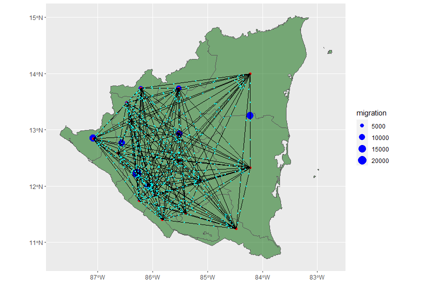

# Gravity Models

### Introduction

​	We started to understand gravity models by following Dr. Ds Idiots Guide to Spatial Interaction Modelling for Dummies. The guide took us through making a gravity model for London. After I plotted the spatial outline of London, I generated a distance matrix. You have to generate a distance matrix to convert the distances from decimal degrees to meters. I then created a flow estimate model using the census data from 2001. I created flow estimates that totaled to 93803. I then tested the fit of the model where I got and R^2 value of 0.5033. This equates to 50.33% of the variation is accounted for in the model. The root mean square error was 203.352. The RMSE is better the closer it is to 0. So, I went in to improve the model. The guide took me through the process of calibrating the parameters of the flow data. This is usually done using the goodness-of-fit statistics. I used the Poisson regression.

You want a linear correlation when plotting the total and the distance. In order to have this  for the model, both sides of the equation need a log transformation. Then we get this plot:

Then, by using the generalized linear models function, we can run a summary on the Poisson regression model. I noticed that all of the beta parameters are useful using their p-values. I wanted to make sure that the model was in fact more useful than what we had started with. I calculated both the R^2 and the RMSE values. The r^2 value was now 0.6726 and the RMSE value is 1892.615. There was an improvement on both of the statistical measures, so we can claim that the new model is more useful.

We want to investigate migration flows for many different reasons, including urban and regional development, economics, and epidemiology. Garcia et al. explain the importance of gravity models, compare the census data for 10 different sub-Saharan African countries, and investigated the significance of their gravity models. They explain the importance of migration flow models for lower income countries. There is a limited amount of data. GPS trip logging, mobile phone data, census data, national level surveys, transportation networks, and even currency can then be used to create agent based models. This data can be used together to create various spatial plots about human development. I chose to further investigation the migration patterns of Nicaragua. Nicaragua is located in Central America and is considered a low or middle income country. Garcia et al. state the questions "why do humans migrate and how far do they migrate". They explain migration as a push-pull interaction where people seek to maximize their befits while minimizing their costs. I hope to investigate these migration patterns by building my own gravity model.

### OD Matrix

​	I started by creating an origin-destination matrix, as seen below. An OD matrix is a matrix where each cell represent the number of trip from origin (row) to the destination(column). The data frame has 210 rows, which means their are 210 ways to travel between each of the counties. My migration flows file only had 15 center points, while my shape file had 18. The flows data frame only had numbers for the counties in Nicaragua but I am also putting below the list of 18 from the shape file. 

| County Names    |
| --------------- |
| Atlántico Norte |
| Atlántico Sur   |
| Boaco           |
| Carazo          |
| Chinandega      |
| Chontales       |
| Estelí          |
| Granada         |
| Jinotega        |
| Lago Nicaragua  |
| León            |
| Madriz          |
| Managua         |
| Masaya          |
| Matagalpa       |
| Nueva Segovia   |
| Río San Juan    |
| Rivas           |

Here is what the first couple of rows actually looks like:

I wanted to add another variable that would be used for further specification of a gravity model. So I added nighttime lights. But again the issue of the varying amounts of center points came into play. So I created two OD matrices. The one above has the 15 locations, 210 rows, the distance between each point, and the migration flow. The second OD matrix, the one below, has the names of the locations of the 18 center points, 306 rows, the distance between each point and the nighttime light count. Th OD matrix is used to model the migration patterns. The matrix contains the amount of people who travel between each point. This shows how heavily traveled certain paths are. The distance is also important. A longer distance will probably have more people in one sense because more people can live along that line. But it can also have less people because less people would want to travel that far of a distance. It would be too costly. Like Garcia et al. explained, people seek to maximize their befits while minimizing their costs. traveling too far would not minimize the cost.

### Migration

I was able to plot a migration plot.

I was also able to produce an animation along each of the paths from the center points. However, this animation only had one point traveling between each point. In order to make the animation more accurate, I could use the OD matrix. I could weight the amount of points using the flow. All the points also arrived at their destination at the same time. This too is not very accurate. I could better this by using the distance of the line to determine how long it took for each point to travel. The gravity model would further improve this because it is providing an estimate of the migration flow. 

##### Voronoi Polygons

​	The voronoi polygons could be used to produce a more accurate migration model. The center points would be based off of the actual population settlements instead of the center points of the different counties. I could better understand how actual people travel from location to location. In order to better estimate the amount of points traveling, I could use the information from my OD matrix to once again weight these points. Even though the data would not line up exactly, it would still provide an educated estimate. I would once again use the distance to alter the time it takes to get from one point to another. The gravity model will add another layer of educated estimation that would improve the models accuracy. By understanding the migration and transport activities, we can combine them to get a real understanding of the migration patterns within Nicaragua.

### Conclusion

​	In conclusion, the models that I produced can be used to better understand the migration habits in Nicaragua. This can be useful for many different things as described by Garcia et al. The models can also be used to better support each other. They can build off of each other by adding new dimensions. These kinds of models are very important for lower and middle income countries so they can better understand their populations without the added costs of extra data collection.
