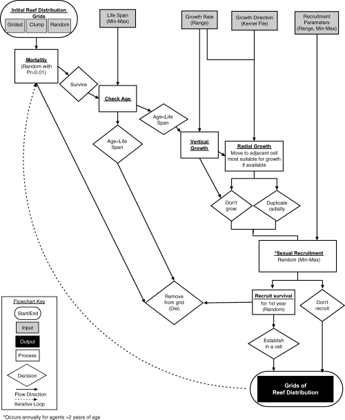

​	A UBC Okanagan researcher, Bruno Carturan, worked with scientists from Australia's Flinders' University and privately-owned research firm Nova Blue Environment to create a new way to support the growth and development of coral reefs. By using agent-based modeling, Carturan is predicting and visualizing different way a reef can develop. Coral reefs are affected by the type of coral, the other sea creatures around them, such as fish, and susceptibility to disturbances such as cyclones and coral bleaching. Coral reefs are hard to predict and map due to their size, timeframe, and variety of coral types and needs. Carturan goes on to explain how agent-based modeling will help the challenging endeavor of predicting coral reef habits. By running simulations over and over again, the model can identify combinations that can provide the greatest resilience for coral reefs. This will help ecologists design reef management and restoration strategies based off of the predictions generated from the agent-based model, says collaborating Flinders researcher Professor Corey Bradshaw.

https://phys.org/news/2020-08-reef-health.html

​      Another research group published the paper “Using Agent‐Based Models to Aid Reef Restoration: Enhancing Coral Cover and Topographic Complexity through the Spatial Arrangement of Coral Transplants”. This group is focusing on how to optimize high coral cover and topographic complexity due to the sheer time, expense, and complexity of restoring coral reefs. Similarly to Carturan, this research group is also using agent based modeling to illustrate the different scenarios of reef restoration and their outcomes. They used an agent-based modelling method developed in the Swarm open source environment. They simulation was based off of a 18 by 18 meter plane. Coral was represented by 10 cm2 points. The plot would update after a “year” had passed. They used factors such as growth rate, mortality rate, reproduction rate, availability of space surrounding the coral points, and maximum number of eggs or sexual recruits. The group used actual measured values to create these variables. The research group ran this model 30 years for each type of coral. They assumed that outside environmental factors would remain constant of the simulation. They ran the simulation with fast reproducing coral (r-selected) and coral that reproduces at a slower rate (K-selected). After separating those two groups they ran the simulation with even‐gridded distributions (gridded), gridded distributions where individuals were clumped into groups of four (clumped), and random distributions. Topographic complexity was calculated as rugosity, a measure of small-scale variations of amplitude in the height of a surface, and the hypsometric integral, a summary measure of the shape of the hypsometric curve. “The outcomes of the model suggest that even‐spaced gridded transplanting arrangements provide the fastest increase in coral cover and three‐dimensional habitat space (topographic complexity) across large temporal scales (<30 years) for corals with r‐selected life history strategies.” This study illustrated how agent-based modeling can help support coral transplanting programs. Coral transplantation is a very tedious, necessary, and time-costly process. By simulating this process, coral reefs can be saved in a much more efficient way.

https://onlinelibrary.wiley.com/doi/full/10.1111/j.1526-100X.2005.00087.x
