# Project 1
## Nicaragua details
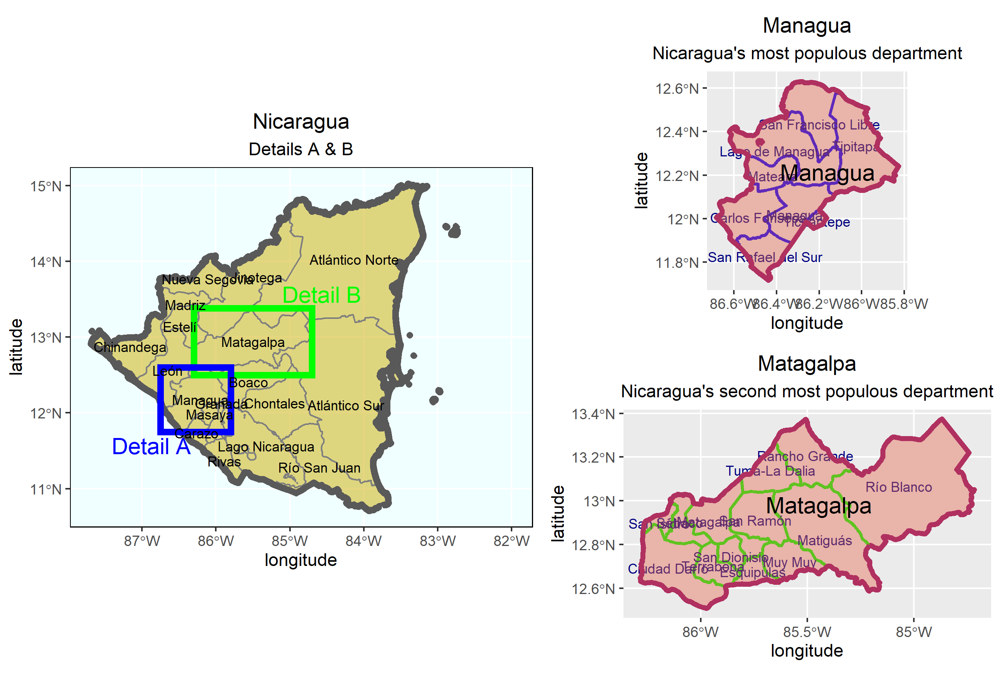

## Population

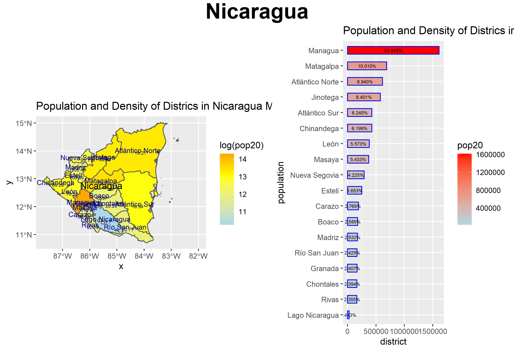
Here is a close up of the bar plot:
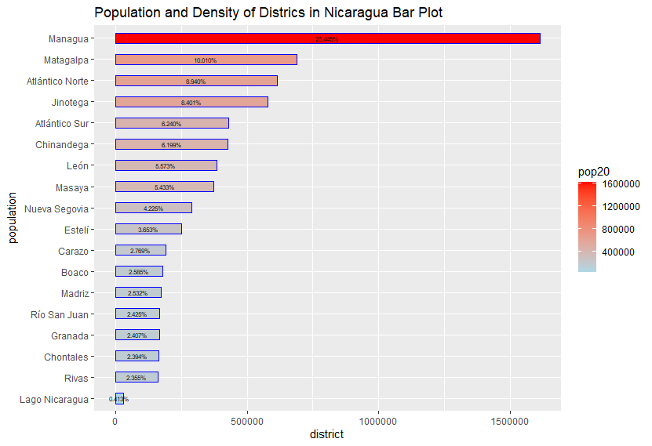

Here is both the population and the log of the population:

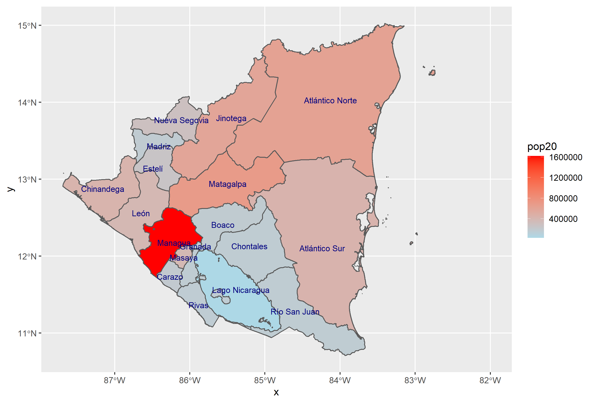
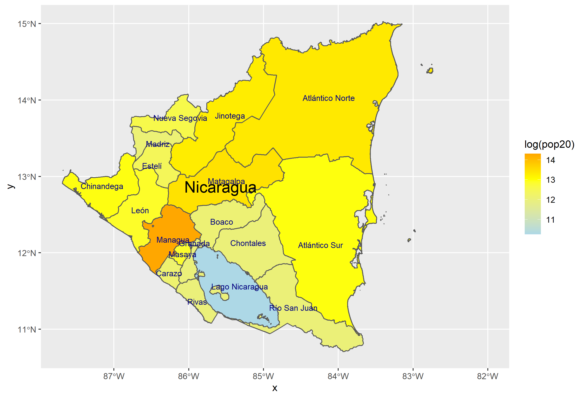

Histograms for population and night time lights:

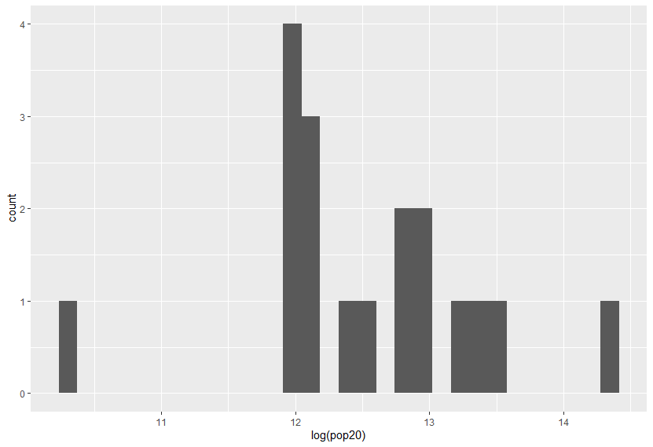
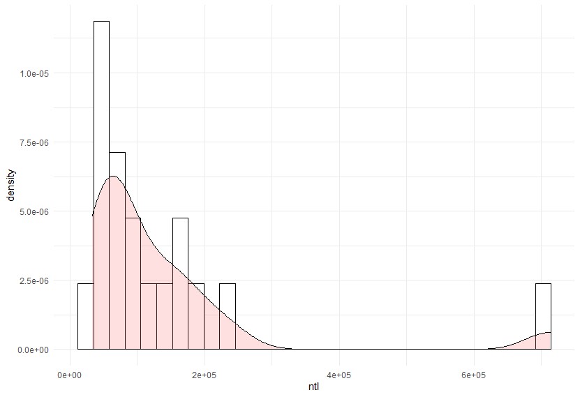

## Topography of Nicaragua

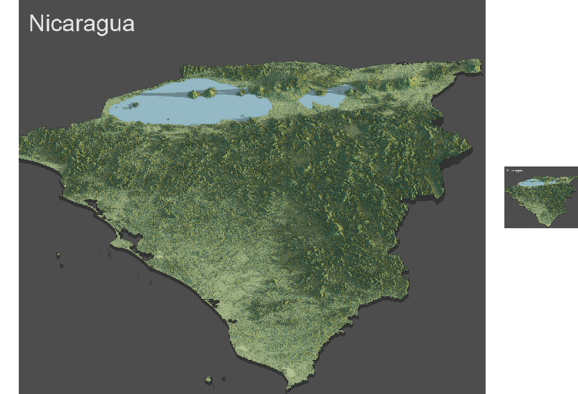

## Boaco, Nicaragua

Here is a density image with the projected urban areas:
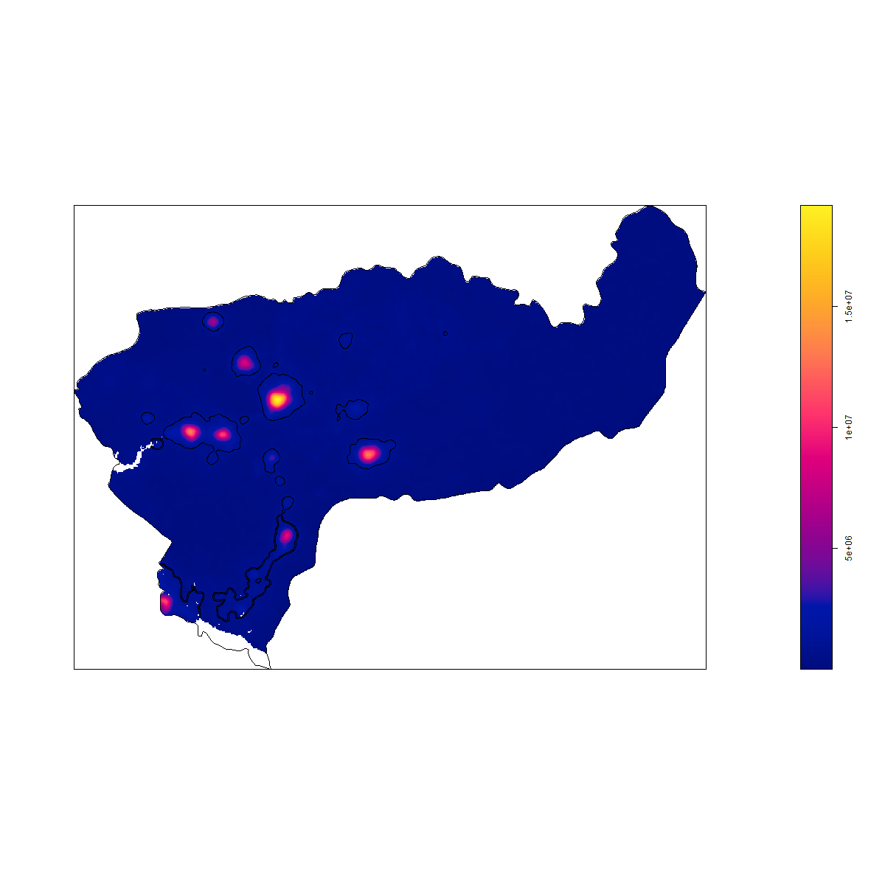

Population of urban areas:
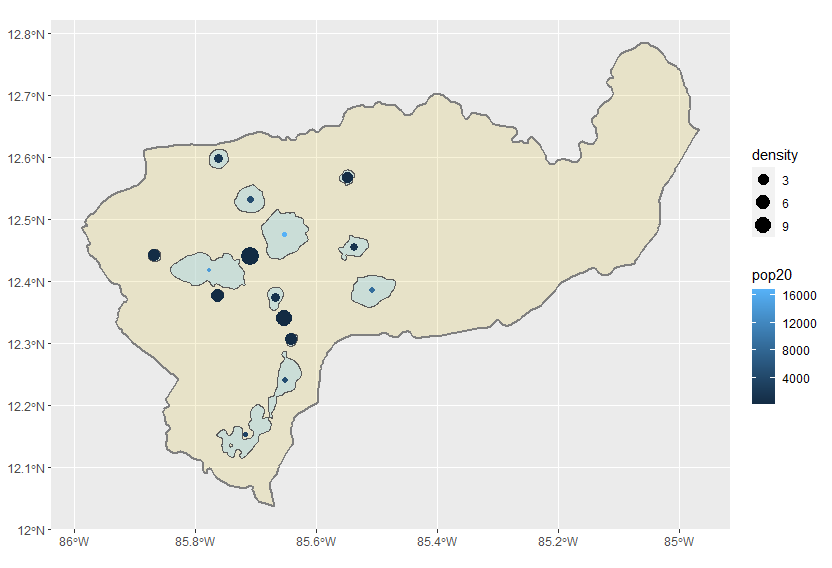

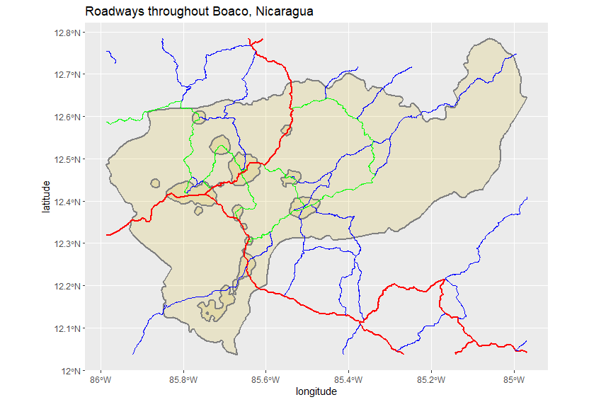
 
 The red lines are primary roads, green are secondary, and blue are tertiary. In this map we can see that the roads run through the highest density areas. You can really notice this by looking at the primary and tertiary roads that run along the bottom left side of Boaco.
 
Topography of Boaco:

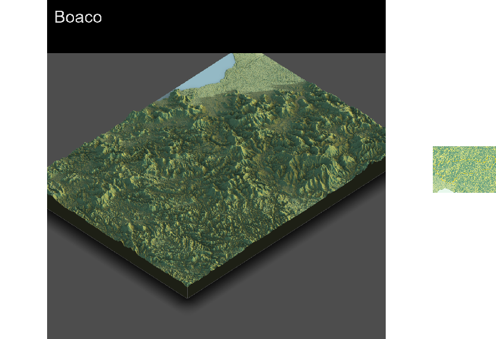
