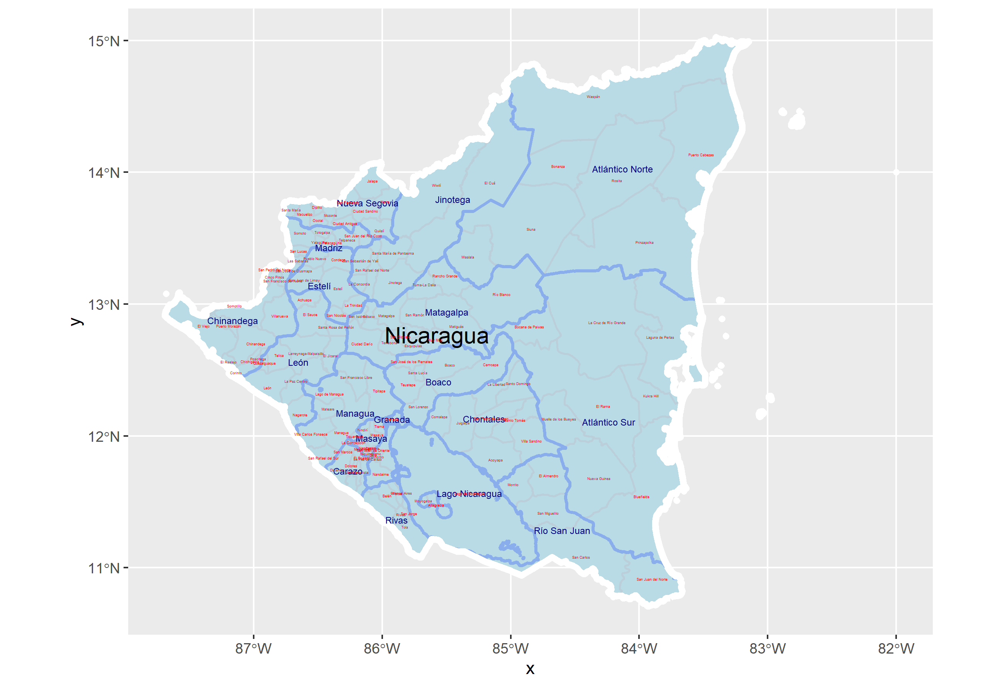

# Project 2.1

Here are the administrative boundaries for Belize and Nicaragua

Due to only having level 1 administrative boundaries for Belize I broke Nicaragua down into the two most populus departments.

Here is the population and log of the population for each department in Belize.

Cayo is the most populated depatment in Belize. It also has the only major road leading to Guatemala. Belize is the second largest department and that is probable due to it haveing a large port city, Belize City.
